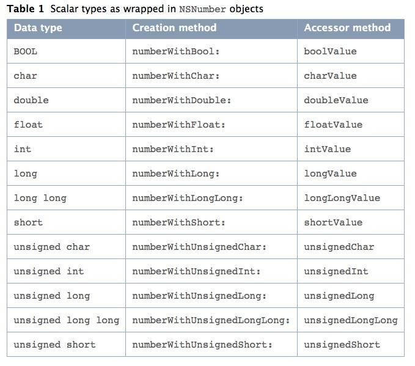

# NSNumber （用于包装基本数据类型的）



```objective-c
//基本数据类型不能存储进入NSArray
// NSArray *arr = @[10,20,30,40] ;
 
// 
NSNumber *num1 = [NSNumber numberWithInt:10] ;
NSNumber *num2 = [NSNumber numberWithInt:20] ;
NSNumber *num3 = [NSNumber numberWithInt:30] ;
NSNumber *num4 = [NSNumber numberWithInt:40] ;
NSArray *arr = @[num1,num2,num3,num4] ;

// 快捷方式
NSArray *arr = @[@(10),@(20),@(30),@(40)] ;

+ (NSNumber*)numberWithChar:(char)value;
+ (NSNumber*)numberWithUnsignedChar:(unsignedchar)value;
+ (NSNumber*)numberWithShort:(short)value;
+ (NSNumber*)numberWithUnsignedShort:(unsignedshort)value;
+ (NSNumber*)numberWithInt:(int)value;
+ (NSNumber*)numberWithUnsignedInt:(unsignedint)value;
+ (NSNumber*)numberWithLong:(long)value;
+ (NSNumber*)numberWithUnsignedLong:(unsignedlong)value;
+ (NSNumber*)numberWithLongLong:(longlong)value;
+ (NSNumber*)numberWithUnsignedLongLong:(unsignedlonglong)value;
+ (NSNumber*)numberWithFloat:(float)value;
+ (NSNumber*)numberWithDouble:(double)value;
+ (NSNumber*)numberWithBool:(BOOL)value;
+ (NSNumber*)numberWithInteger:(NSInteger)valueNS_AVAILABLE(10_5,2_0);
+ (NSNumber*)numberWithUnsignedInteger:(NSUInteger)valueNS_AVAILABLE(10_5,2_0);
```


# NSValue (用于包装结构体的)

```objective-c
NSPoint p1 = NSMakePoint(3,7) ;
NSPoint p2 = NSMakePoint(3,7) ;
NSPoint p3 = NSMakePoint(3,7) ;
//
NSValue *vp1 = [NSValue valueWithPoint:p1] ;
NSValue *vp2 = [NSValue valueWithPoint:p2] ;
NSValue *vp3 = [NSValue valueWithPoint:p3] ;
//
NSArray *arr = @[vp1,vp2,vp3] ;

+ (NSValue*)valueWithCGPoint:(CGPoint)point;
+ (NSValue*)valueWithCGSize:(CGSize)size;
+ (NSValue*)valueWithCGRect:(CGRect)rect;
+ (NSValue*)valueWithCGAffineTransform:(CGAffineTransform)transform;
+ (NSValue*)valueWithUIEdgeInsets:(UIEdgeInsets)insets;
+ (NSValue*)valueWithUIOffset:(UIOffset)insetsNS_AVAILABLE_IOS(5_0);
```


# NSData(二进制数据)

在文件操作（如保存到本地）、网络、以及核心图形图像中使用较广泛。

```objective-c
//对象方法创建
NSData *data1 = [[NSData alloc] init];
NSData *data2 = [[NSData alloc] initWithData:data1];

//类方法创建
NSData *data3 = [NSData data];
NSData *data4 = [NSData dataWithData:data3];

//由文件创建
NSString *filePath = [NSHomeDirectory() stringByAppendingString:@"/Desktop/test.txt"];  
NSData *data5 = [[NSData alloc] initWithContentsOfFile:filePath];
NSData *data6 = [NSData dataWithContentsOfFile:filePath];

// 由 URL 创建
NSURL *urlPath = [NSURL URLWithString:[@"file://" stringByAppendingString:[NSHomeDirectory() stringByAppendingString:@"/Desktop/test.txt"]]];
NSData *data7 = [[NSData alloc] initWithContentsOfURL:urlPath];
NSData *data8 = [NSData dataWithContentsOfURL:urlPath];

// 由 字符串 创建
NSString *string = @"bei jing nin hao";
NSData *data9 = [string dataUsingEncoding:NSUTF8StringEncoding];
NSData *data10 = [string dataUsingEncoding:NSUTF8StringEncoding allowLossyConversion:YES];

// 可变 NSData 的创建
// 初始化时指定对象拥有的字节空间大小，在需要时会增加内存空间，在初始化时并没有分配内存空间
NSMutableData *data11 = [[NSMutableData alloc] initWithCapacity:5];
NSMutableData *data12 = [NSMutableData dataWithCapacity:5];

// 初始化时为对象分配指定长度的归零字节
NSMutableData *data13 = [[NSMutableData alloc] initWithLength:10];
NSMutableData *data14 = [NSMutableData dataWithLength:10];
```

> NSData与NSString、Byte、UIImage之间的转换

```objective-c
//NSString 转换成 NSData
NSString *str = @"Hello";
NSData *strData = [str dataUsingEncoding:NSUTF8StringEncoding];

//NSData 转换成 NSString
NSString *str1 = [[NSString alloc]initWithData:strData encoding:NSUTF8StringEncoding];

//Byte 转换成 NSData
Byte byte[] = {1,2,3,4,5,6,7,8,9,10};  
NSData *byteData = [[NSData alloc] initWithBytes:byte length:10];

//NSData 转换成 Byte 
Byte *testByte = (Byte *)[byteData bytes]; 

//UIImage 转换成 NSData
NSData *imageData1 = UIImagePNGRepresentation(UIImage *image);     //png 格式 
NSData *imageData2 = UIImageJPEGRepresentation(UIImage *image, CGFloat compressionQuality)  //jpeg格式  

//NSData 转换成 UIImage
UIImage *aimage = [UIImage imageWithData: imageData]; 
```


# NSNull

```objective-c
+（NSNull *)null ;

// 初始化一个 null 对象
[NSNull null]
```


