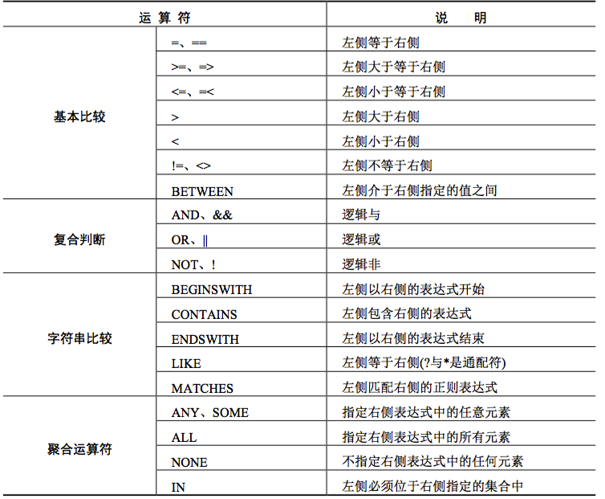

# NSPredicate - 谓词

NSPredicate是一个逻辑条件的定义, 这个逻辑条件用来约束一个搜索条件, 而这个搜索条件用于数据的获取或内存中数据的过滤



- `%@` : 用于参数替换,目标为对象类型,如:`NSString、NSNumber、NSDate`等;
- `%K` : 用于参数替换,目标为键值;

```objective-c
// 匹配手机号
+ (BOOL)checkPhoneNumber:(NSString *)phoneNumber
{
    NSString *regex = @"^[1][3-8]\\d{9}$";
    NSPredicate *pred = [NSPredicate predicateWithFormat:@"SELF MATCHES %@", regex];
    return [pred evaluateWithObject:phoneNumber];
}


// 验证邮箱
+ (BOOL)validateEmail:(NSString *)email{
    NSString *emailRegex = @"[A-Z0-9a-z._%+-]+@[A-Za-z0-9.-]+\\.[A-Za-z]{2,4}"; 
    NSPredicate *emailTest = [NSPredicate predicateWithFormat:@"SELF MATCHES %@", emailRegex]; 
    return [emailTest evaluateWithObject:email];
}
```

```objective-c
//
//  Student.h
//  NSPredicateDemo
//
//  Created by Hadlinks on 2018/9/12.
//  Copyright © 2018 Hadlinks. All rights reserved.
//

#import <Foundation/Foundation.h>

@interface Student : NSObject

  /** 姓名 */
  @property (nonatomic, copy) NSString *name;

  /** 分数 */
  @property (nonatomic, assign) int score;

  /** 分数2 */
  @property (nonatomic, strong) NSNumber *score2;

  /** 等级 */
  @property (nonatomic, assign) int grade;

@end
  
  
//
//  Student.m
//  NSPredicateDemo
//
//  Created by Hadlinks on 2018/9/12.
//  Copyright © 2018 Hadlinks. All rights reserved.
//

#import "Student.h"

@implementation Student

@end
  
// ===============================================
Student *student0 = [[Student alloc] init];
student0.name = @"Lady Mary Crawley";
student0.score = 70;
student0.grade = 6;
    
Student *student1 = [[Student alloc] init];
student1.name = @"Lady Edith Crawley";
student1.score = 90;
student1.grade = 7;
    
Student *student2 = [[Student alloc] init];
student2.name = @"Lady Sybil Crawley";
student2.score = 98;
student2.grade = 7;
    
NSArray *students = @[student0, student1, student2];
```

> ## 比较运算符

```objective-c
//  >    大于
//  <     小于
//  >=    大于等于
//  <=    小于等于
//  =或==     等于
//  !=或<>   不等于

// 大于
NSPredicate *predicate = [NSPredicate predicateWithFormat:@"%K > %d", @"score", 90];
NSLog(@"predicate.predicateFormat: %@", predicate.predicateFormat);
//
NSArray *filterStudents = [students filteredArrayUsingPredicate:predicate];
[filterStudents enumerateObjectsUsingBlock:^(Student *student, NSUInteger idx, BOOL * _Nonnull stop) {
    NSLog(@"[score > 90] student name is: %@", student.name);
}];
// predicate.predicateFormat: score > 90
// [score > 90] student name is: Lady Sybil Crawley


// 不等于
NSPredicate *predicate = [NSPredicate predicateWithFormat:@"%K != %d", @"score", 90];
NSLog(@"predicate.predicateFormat: %@", predicate.predicateFormat);
NSArray *filterStudents = [students filteredArrayUsingPredicate:predicate];
[filterStudents enumerateObjectsUsingBlock:^(Student *student, NSUInteger idx, BOOL * _Nonnull stop) {
    NSLog(@"[score != 90] student name is: %@", student.name);
}];
//predicate.predicateFormat: score != 90
//[score != 90] student name is: Lady Mary Crawley
//[score != 90] student name is: Lady Sybil Crawley
```


> ## 逻辑运算符

```objective-c
// AND 或 && :   与
// OR   或 || :   或
// NOT 或  ! :    非
  
NSPredicate *predicate = [NSPredicate predicateWithFormat:@"%K != %d && %K = %d", @"score", 90, @"grade", 7];
NSLog(@"predicate.predicateFormat: %@", predicate.predicateFormat);
NSArray *filterStudents = [students filteredArrayUsingPredicate:predicate];
[filterStudents enumerateObjectsUsingBlock:^(Student *student, NSUInteger idx, BOOL * _Nonnull stop) {
    NSLog(@"[score != 90 且 grade == 7] student name is: %@", student.name);
}];

//predicate.predicateFormat: score != 90 AND grade == 7
//[score != 90 且 grade == 7] student name is: Lady Sybil Crawley
```

> ##关系运算符

```objective-c
// NONE      没有元素,等同于NOT ANY (集合中没有任何元素满足条件就返回YES。如:NONE person.age < 18，表示person集合中所有元素的age>=18时，才返回YES)
// ANY        任意一个 (集合中任意一个元素满足条件，就返回YES)
// SOME      一些,等同于ANY (集合中任意一个元素满足条件，就返回YES)
// ALL        所有元素 (集合中所有元素都满足条件，才返回YES)
// IN          包含 (等价于SQL语句中的IN运算符，只有当左边表达式或值出现在右边的集合中才会返回YES)
// BETWEEN 范围, 例如：BETWEEN {10, 20}，表示大于等于10，小于等于20的范围

NSPredicate *predicate = [NSPredicate predicateWithFormat:@"%K IN {%d, %d, %d, %d, %d}", @"score", 70, 75, 80, 85, 90];
NSLog(@"predicate.predicateFormat: %@", predicate.predicateFormat);
NSArray *filterStudents = [students filteredArrayUsingPredicate:predicate];
[filterStudents enumerateObjectsUsingBlock:^(Student *student, NSUInteger idx, BOOL * _Nonnull stop) {
    NSLog(@"分数在{70, 75, 80, 85, 90}之中的学生姓名是: %@", student.name);
}];

// predicate.predicateFormat: score IN {70, 75, 80, 85, 90}
// 分数在{70, 75, 80, 85, 90}之中的学生姓名是: Lady Mary Crawley
// 分数在{70, 75, 80, 85, 90}之中的学生姓名是: Lady Edith Crawley
```


> **查找两个数组中相同或不同的元素**

```objective-c
Student *student0 = [[Student alloc] init];
student0.name = @"Lady Mary Crawley";
    
Student *student1 = [[Student alloc] init];
student1.name = @"Lady Edith Crawley";
    
Student *student2 = [[Student alloc] init];
student2.name = @"Lady Sybil Crawley";
    
Student *student3 = [[Student alloc] init];
student3.name = @"Thomas·小火车";

NSArray *arr1 = @[student0, student1];
NSArray *arr2 = @[student1, student2, student3];

// 1. 查找相同的元素
NSPredicate *filterPredicateSame = [NSPredicate predicateWithFormat:@"SELF IN %@", arr2];
NSArray *sameArr = [arr1 filteredArrayUsingPredicate:filterPredicateSame];
[sameArr enumerateObjectsUsingBlock:^(Student *student, NSUInteger idx, BOOL * _Nonnull stop) {
    NSLog(@"两个数组中相同的元素有 = %@", student.name);
}];
// 两个数组中相同的元素有 = Lady Edith Crawley


// 2. 查找不同的元素
NSPredicate *filterPredicateDiff = [NSPredicate predicateWithFormat:@"NOT (SELF IN %@)", arr2];
// arr1中不同的元素
NSArray *diffArr1 = [arr1 filteredArrayUsingPredicate:filterPredicateDiff];
// arr2中不同的元素
filterPredicateDiff = [NSPredicate predicateWithFormat:@"NOT (SELF IN %@)", arr1];
NSArray *diffArr2 = [arr2 filteredArrayUsingPredicate:filterPredicateDiff];
    
NSMutableArray *diffArr = [NSMutableArray arrayWithArray:diffArr1];
[diffArr addObjectsFromArray:diffArr2];
[diffArr enumerateObjectsUsingBlock:^(Student *student, NSUInteger idx, BOOL * _Nonnull stop) {
    NSLog(@"两个数组中不同的元素有 = %@", student.name);
}];

// 两个数组中不同的元素有 = Lady Mary Crawley
// 两个数组中不同的元素有 = Lady Sybil Crawley
// 两个数组中不同的元素有 = Thomas·小火车
```


> 范围之间`BETWEEN`

```objective-c
NSPredicate *predicate = [NSPredicate predicateWithFormat:@"%K BETWEEN {%d, %d}", @"score", 90, 100];
NSLog(@"predicate.predicateFormat: %@", predicate.predicateFormat);
NSArray *filterStudents = [students filteredArrayUsingPredicate:predicate];
[filterStudents enumerateObjectsUsingBlock:^(Student *student, NSUInteger idx, BOOL * _Nonnull stop) {
    NSLog(@"分数在{90, 100}之间的学生姓名是: %@", student.name);
}];

// predicate.predicateFormat: score BETWEEN {90, 100}
// 分数在{90, 100}之间的学生姓名是: Lady Edith Crawley
// 分数在{90, 100}之间的学生姓名是: Lady Sybil Crawley
```


> `NONE`

```objective-c
NSPredicate *predicate = [NSPredicate predicateWithFormat:@"NONE %K < %d", @"score", 60];
NSLog(@"predicate.predicateFormat: %@", predicate.predicateFormat);

BOOL flunk = [predicate evaluateWithObject:students];
NSLog(@"%@", flunk ? @"三名学生都及格了" : @"有不及格的学生");

//predicate.predicateFormat: NOT ANY score < 60
//三名学生都及格了
```

> ## 字符串相关

```objective-c
//   SELF         字符串本身 (代表正在被判断的对象自身)
//   BEGINSWITH  以什么开头
//   ENDSWITH      以什么结尾
//   CONTAINS      包含
//   LIKE             匹配
//   *                  通配符 （配合LIKE使用）
//   ?                  代表一个字符 （配合LIKE使用）
//   MATCHES       正则表达式

// MARK: - 字符串
        let str = "hello holy! it's so cold today!"
        let p01 = NSPredicate(format: "SELF CONTAINS 'cold'")
        if p01.evaluate(with: str) {
            print("p01: ")
        }

        let p02 = NSPredicate(format: "SELF LIKE[c] 'hello'")
        if p02.evaluate(with: str) {
            print("p02: ")
        }

        let p03 = NSPredicate(format: "SELF LIKE[c] '*ello'")
        if p03.evaluate(with: str) {
            print("p03: ")
        }

        let p04 = NSPredicate(format: "SELF LIKE[c] '?ello'")
        if p04.evaluate(with: str) {
            print("p04: ")
        }

        let p05 = NSPredicate(format: "SELF LIKE '?Ello*'")
        if p05.evaluate(with: str) {
            print("p05: ")
        }

        let p06 = NSPredicate(format: "SELF LIKE[c] 'hello*!'")
        if p06.evaluate(with: str) {
            print("p06: ")
        }
        let p07 = NSPredicate(format: "SELF IN %@", str)
        if p07.evaluate(with: "hello") {
            print("p07: ")
        }


// MARK: - 集合
// 包含 `CONTAINS`
NSPredicate *predicate = [NSPredicate predicateWithFormat:@"%K CONTAINS %@", @"name", @"S"];
NSLog(@"predicate.predicateFormat: %@", predicate.predicateFormat);
NSArray *filterStudents = [students filteredArrayUsingPredicate:predicate];
[filterStudents enumerateObjectsUsingBlock:^(Student *student, NSUInteger idx, BOOL * _Nonnull stop) {
    NSLog(@"学生姓名中包含字母'S'的有: %@", student.name);
}];
// predicate.predicateFormat: name CONTAINS "S"
// 学生姓名中包含字母'S'的有: Lady Sybil Crawley


// 以什么开头BEGINSWITH 以什么结尾ENDSWITH
NSPredicate *predicate = [NSPredicate predicateWithFormat:@"%K BEGINSWITH %@", @"name", @"Lady E"];
NSLog(@"predicate.predicateFormat: %@", predicate.predicateFormat);
NSArray *filterStudents = [students filteredArrayUsingPredicate:predicate];
[filterStudents enumerateObjectsUsingBlock:^(Student *student, NSUInteger idx, BOOL * _Nonnull stop) {
    NSLog(@"学生姓名中\"Lady E\"开头的有: %@", student.name);
}];
// predicate.predicateFormat: name BEGINSWITH "Lady E"
// 学生姓名中"Lady E"开头的有: Lady Edith Crawley


// 匹配LIKE
NSPredicate *predicate = [NSPredicate predicateWithFormat:@"%K LIKE %@", @"name", @"Mary"];
NSLog(@"predicate.predicateFormat: %@", predicate.predicateFormat);
NSArray *filterStudents = [students filteredArrayUsingPredicate:predicate];
[filterStudents enumerateObjectsUsingBlock:^(Student *student, NSUInteger idx, BOOL * _Nonnull stop) {
    NSLog(@"学生姓名精确匹配'Mary'的有: %@", student.name);
}];
// predicate.predicateFormat: name LIKE "Mary"

NSPredicate *predicate = [NSPredicate predicateWithFormat:@"%K LIKE %@", @"name", @"*Mary*"];
NSLog(@"predicate.predicateFormat: %@", predicate.predicateFormat);
NSArray *filterStudents = [students filteredArrayUsingPredicate:predicate];
[filterStudents enumerateObjectsUsingBlock:^(Student *student, NSUInteger idx, BOOL * _Nonnull stop) {
    NSLog(@"学生姓名模糊匹配'Mary'的有: %@", student.name);
}];
// predicate.predicateFormat: name LIKE "*Mary*"
// 学生姓名模糊匹配'Mary'的有: Lady Mary Crawley

NSPredicate *predicate = [NSPredicate predicateWithFormat:@"%K LIKE %@", @"name", @"Lady Sybil*"];
NSLog(@"predicate.predicateFormat: %@", predicate.predicateFormat);
NSArray *filterStudents = [students filteredArrayUsingPredicate:predicate];
[filterStudents enumerateObjectsUsingBlock:^(Student *student, NSUInteger idx, BOOL * _Nonnull stop) {
    NSLog(@"学生姓名模糊匹配'Lady Sybil'的有: %@", student.name);
}];
// predicate.predicateFormat: name LIKE "Lady Sybil*"
// 学生姓名模糊匹配'Lady Sybil'的有: Lady Sybil Crawley

NSPredicate *predicate = [NSPredicate predicateWithFormat:@"%K LIKE %@", @"name", @"?????S*"];
NSLog(@"predicate.predicateFormat: %@", predicate.predicateFormat);
NSArray *filterStudents = [students filteredArrayUsingPredicate:predicate];
[filterStudents enumerateObjectsUsingBlock:^(Student *student, NSUInteger idx, BOOL * _Nonnull stop) {
    NSLog(@"学生姓名中第6个字符为'S'的有: %@", student.name);
}];
// predicate.predicateFormat: name LIKE "?????S*"
// 学生姓名中第6个字符为'S'的有: Lady Sybil Crawley
```

