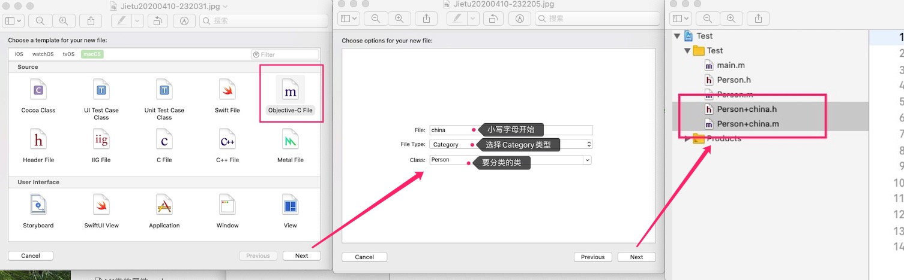

# 分类 Category  （将一个类分为多个模块）

- 只能再分类中增加方法，不可以增加属性
- 当一个类很臃肿的情况下可以使用分类来归纳整理相同功能的方法
- 创建一个分类文件



- 生成文件
  - 本类名+分类名.m
  - 本类名+分类名.h

```objective-c
//
//  Person.h
//  Test
//
//  Created by fraser on 2020/4/10.
//  Copyright © 2020 xant. All rights reserved.
//

#import <Foundation/Foundation.h>

@interface Person : NSObject

@end

```

```objective-c
//
//  Person.m
//  Test
//
//  Created by fraser on 2020/4/10.
//  Copyright © 2020 xant. All rights reserved.
//

#import "Person.h"

@implementation Person

@end
```


```objective-c
//
//  Person+china.h
//  Test
//
//  Created by fraser on 2020/4/10.
//  Copyright © 2020 xant. All rights reserved.
//

#import "Person.h"

@interface Person (china)

@end


```


```objective-c
//
//  Person+china.m
//  Test
//
//  Created by fraser on 2020/4/10.
//  Copyright © 2020 xant. All rights reserved.
//

#import "Person+china.h"

@implementation Person (china)

@end

```


```objective-c
#import "Person.h"
#import "Person+china.h"

// 如果要使用分类中定义的方法 ，需要引入分类的头文件
```

