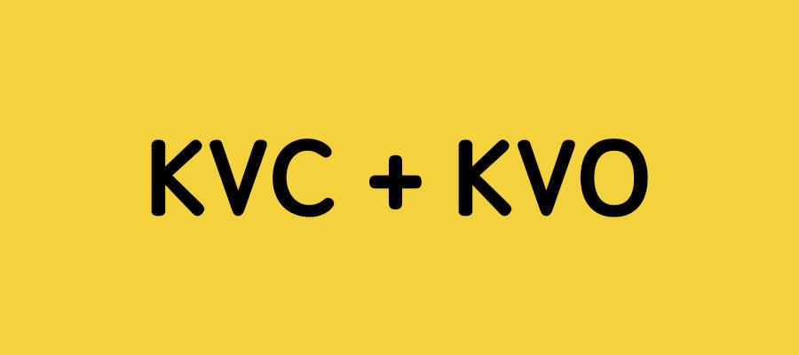
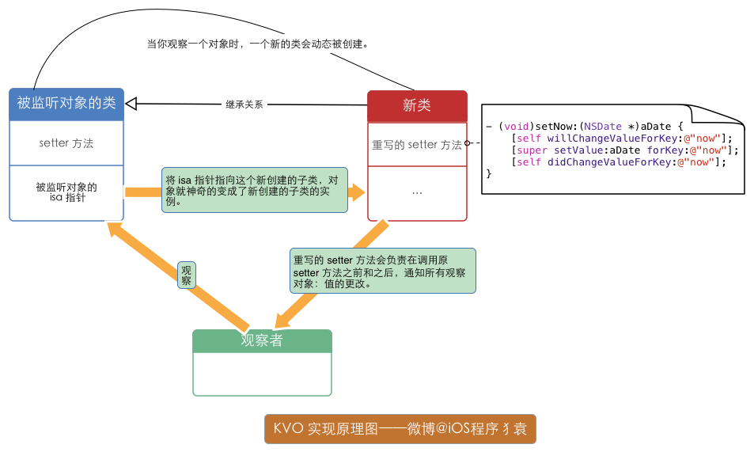

# Key-Value Coding(键值编码)


- KVC 提供了一套通过Key或者KeyPath直接访问对象属性的机制。
- KVC 可以在运行时动态地访问和修改对象的属性
-  KVC 是以下技术的实现基础 KVO、Core Data、Cocoa bindings、AppleScript。
- KVC 性能略逊于访问器和实例变量，但是灵活性高，很多时候可以简化代码。
- 使用KVC需要实现其存取方法，相关的方法都在Objective-C的NSKeyValueCoding协议中声明，超级父类`NSObject`默认遵守该协议。
- KVC支持对象属性（如NSSting）同时也指出非对象属性（基本数据类型和结构体，提供自动转换数据类型）。


| **名称** | **内容**                                                     |
| -------- | ------------------------------------------------------------ |
| Key      | Key是标识对象具体属性的字符串，相当于对象的访问器名称或者变量名称，不能包含空格。 |
| KeyPath  | KeyPath是指定对象一系列属性，且用.分割每个属性的字符串。字符串序列中的每个key标识前面对象的属性。比如说people.address.street能够获取people的address属性，然后获取到address的street属性。 |


# 基础API

```objective-c
// 修改私有成员变量
- (void)setValue:(id)value forKey:(NSString *)key;
- (void)setValue:(id)value forKeyPath:(NSString *)keyPath;
- (void)setValuesForKeysWithDictionary:(NSDictionary *)keyedValues;

// 取得私有成员变量的值
- (id)valueForKey:(NSString *)key;
- (id)valueForKeyPath:(NSString *)keyPath;
- (NSDictionary *)dictionaryWithValuesForKeys:(NSArray *)keys;

//
+ (BOOL)accessInstanceVariablesDirectly;
//默认返回YES，表示如果没有找到Set<Key>方法的话，会按照_key，_iskey，key，iskey的顺序搜索成员，设置成NO就不这样搜索

- (BOOL)validateValue:(inout id __nullable * __nonnull)ioValue forKey:(NSString *)inKey error:(out NSError **)outError;
//KVC提供属性值正确性�验证的API，它可以用来检查set的值是否正确、为不正确的值做一个替换值或者拒绝设置新值并返回错误原因。

- (NSMutableArray *)mutableArrayValueForKey:(NSString *)key;
//这是集合操作的API，里面还有一系列这样的API，如果属性是一个NSMutableArray，那么可以用这个方法来返回。

- (nullable id)valueForUndefinedKey:(NSString *)key;
//如果Key不存在，且没有KVC无法搜索到任何和Key有关的字段或者属性，则会调用这个方法，默认是抛出异常。

- (void)setValue:(nullable id)value forUndefinedKey:(NSString *)key;
//和上一个方法一样，但这个方法是设值。

- (void)setNilValueForKey:(NSString *)key;
//如果你在SetValue方法时面给Value传nil，则会调用这个方法
```


# 取值

```objective-c
如果没有找到Set<Key>方法的话，会按照_key，_iskey，key，iskey的顺序搜索成员并进行赋值操作
```


```objective-c
// Book类:
@interface Book : NSObject
@property(nonatomic, copy) NSString *bookname;
@end
  
// Person类:
@class Book;
@interface Person : NSObject
  @property(nonatomic, copy) NSString *name;
  @property(nonatomic, assign) int age;
	@property(nonatomic, strong) Book *book;
@end

Person *p1 = [[Person alloc]init];
// p1.name = @"LianXi" ;
// p1.age = 24 ;
[p1 setValue:@"LianXi" forKeyPath:@"name"];
[p1 setValue:@"24" forKeyPath:@"age"];
//
Book *b1 = [[Book alloc] init];
b1.bookname = @"iPhone";
p1.book = b1;


// 赋值
[p1 setValue:@"HuaWei" forKeyPath:@"book.bookname"] ;

// 取值
[p1  valueForKeyPath:@"name"] ;


Person *p2 = [[Person alloc]init];
// p2.name = @"XueXi" ;
// p2.age = 25 ;
[p2 setValue:@"XueXi" forKeyPath:@"name"];
[p2 setValue:@"25" forKeyPath:@"age"];

Book *b2 = [[Book alloc] init];
b2.bookname = @"Mac";
p2.book = b2;

// 取值
NSLog(@"%@, %@", [p1  valueForKeyPath:@"name"], [p1 valueForKeyPath:@"age"]);


// 如果需要只生成name的数组，并打印应该怎么办？

NSArray *persons = @[p1, p2];
NSMutableArray *arrayM = [NSMutableArray array];
for (Person *p in persons) {
      [arrayM addObject:[p valueForKeyPath:@"name"]];
}
NSLog(@"%@", arrayM);
// 打印效果:(LianXi, XueXi)

// KVC方法:
NSArray *persons = @[p1, p2];
NSMutableArray *arrayM = [NSMutableArray array];
[arrayM addObject:[persons valueForKeyPath:@"name"]];
NSLog(@"%@", arrayM);
//打印效果:((LianXi, XueXi))

```


# KVO 键值监听

KVO 即 Key-Value Observing，翻译成键值观察。

它是一种观察者模式的衍生。

其基本思想是，对目标对象的某属性添加观察，当该属性发生变化时，通过触发观察者对象实现的KVO接口方法，来自动的通知观察者。


```objective-c
// observer:观察者，也就是KVO通知的订阅者。订阅着必须实现 
// observeValueForKeyPath:ofObject:change:context:方法
// keyPath：描述将要观察的属性，相对于被观察者。
// options：KVO的一些属性配置；有四个选项。
   //  NSKeyValueObservingOptionNew:change 字典包括改变后的值
   //  NSKeyValueObservingOptionOld:change 字典包括改变前的值
   //  NSKeyValueObservingOptionInitial: 注册后立刻触发KVO通知
   //  NSKeyValueObservingOptionPrior: 值改变前是否也要通知（这个key决定了是否在改变前改变后通知两次
// context: 上下文，这个会传递到订阅着的函数中，用来区分消息，所以应当是不同的。
  
- (void)addObserver:(NSObject *)observer forKeyPath:(NSString *)keyPath options:(NSKeyValueObservingOptions)options context:(void *)context;
- (void)removeObserver:(NSObject *)observer forKeyPath:(NSString *)keyPath;
- (void)willChangeValueForKey:(NSString *)key;
- (void)didChangeValueForKey:(NSString *)key;
- (void)observeValueForKeyPath:(NSString *)keyPath
                      ofObject:(id)object
                        change:(NSDictionary *)change
                       context:(void *)context
```

- 添加观察者
- 在观察者中实现监听方法，`observeValueForKeyPath: ofObject: change: context:`（通过查阅文档可以知道，绝大多数对象都有这个方法，因为这个方法属于NSObject）
- 移除观察者

```objective-c
[a addObserver:b forKeyPath:@"name" options:kNilOptions context:nil];
a.name = @"zzz";

#pragma mark - 实现KVO回调方法
/*
 *  当对象的属性发生改变会调用该方法
 *  @param keyPath 监听的属性
 *  @param object  监听的对象
 *  @param change  新值和旧值
 *  @param context 额外的数据
 */
- (void)observeValueForKeyPath:(NSString *)keyPath ofObject:(id)object change:(NSDictionary<NSString *,id> *)change context:(void *)context
{
   NSLog(@"%@的值改变了,",keyPath);
   NSLog(@"change:%@", change);
}

- (void)dealloc
{
    [a removeObserver:b forKeyPath:@"name"];
}
```


