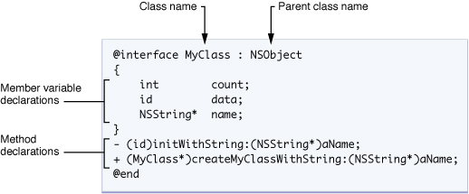

## 类的本质(自定义的一个数据类型)

1. 封装
2. 继承
3. 多态


## 对象之间的关系

1. 组合 :  一个类由其他几个类联合起来组合而成（计算机 和 内存，主板等之间的关系为组合关系）
2. 依赖 : 一个对象的方法参数是另外一个对象 (计算机开机需要电，则电和计算机之间是依赖关系)
3. 关联 : 对象作为类的属性,并且是拥有关系 (人有一台计算机)
4. 继承 : （a.单根性  b.传递性）


## 类的加载(内存中的五大区域)

| 内存区域 |               存储数据               | 回收点         |
| :------: | :----------------------------------: | -------------- |
|    栈    |             存储局部变量             | 作用域执行完毕 |
|    堆    |          手动申请的字节空间          | 开发者管理     |
|  BSS段   |    未被初始化的全局变量，静态变量    | 初始化后       |
|  数据段  | 常量区，已初始化的全局变量，静态变量 | 程序结束       |
|  代码段  |               存储代码               | 程序结束       |

```objective-c
// 某个类第一次被访问的时候，将这个类存储到内存中的代码段区域，直到程序结束时才会被释放，这个过程叫做类加载。

[Person new] ;
[[Person alloc] init];

// 1. 在堆内存中申请一块空间
// 2. 根据类模板创建对象
// 3. 对象中有一个 “isa指针”，指向对象所属的类在代码段中的地址
// 4. 初始化对象属性（NULL,nil）
// 5. 返回对象在堆中的地址

```


##类时以 Class对象 的形式存储在代码段中的

1. class 对象 ------- 用来存储类

```objective-c
//类名 （NSString）
//类的属性集合
//类的方法集合 (方法是以SEL 对象的形式存储在class对象中的)
//isa 指针（指向父类的class对象）
```


## Class 类对象的获取

```objective-c
Person *p = [Person new] ;

// 1. 调用类方法获取class对象
Class cls = [Person class] ;

// 2. 调用对象方法获取class对象
// 		2.1 对象中isa指针就是代码段中的class对象的地址
//    2.2 可以使用class对象来新创建对象
Class cls = [p class] ;

// cls 代表 Person 类
Person *p1 = [cls new] ;
```


## 类的定义

NSObject 是所有类的基类



```objective-c
// 声明部分
@interface Person : NSObject

  
  // 类方法
  +(instancetype)person ;
  +(instancetype)personWithName:(NSString *)name andAge:(int)age ;
  // 如果方法的返回值是 instancetype 表示当前的类对象


  // 属性声明
  @property NSString *name ;
  @property int age ;


  // 对象方法
  // -(返回类型)  外参名:(参数类型)内参名   外参名:(参数类型)内参名 .....
  -(void)run ;
  -(void)eatWithFood:(NSString *)foodName ;
  -(int)sumWith:(int)num1 and:(int)num2  ;


@end
```

```objective-c

// 实现部分
@implementation Person

  #pragma mark - 类方法实现
  +(instancetype)person {
     return [[self alloc] init] ;
  }

  +(instancetype)personWithName:(NSString *)name andAge:(int)age {
      Person *p = [[self alloc] init]  ;
      p.name = name ;
      p.age = age ;
      return p ;
  }

  # 构造函数
  -（instancetype)init{
      if(self = [self init]){
          self.name = @"无名"; 
          self.age = 0 ;
      }
      return self ;
  }

  #pragma mark - 对象方法实现
  -(void)run{
      // 对象方法内部获取对象属性
      NSLog(@"%@ is running.",self.name) ;
  }

  -(void)eatWithFood:(NSString *)foodName {
      NSLog(@"%@ is eating %@.",self.name,foodName) ;
  }

  -(int)sumWith:(int)num1 and:(int)num2 {
      return num1 + num2 ;
  }


@end
```


```objective-c
// 创建对象
// Person *p = [Person new] ;
// Person *p = [[Person alloc] init] ;
Person *p = [Person person] ;

// 对对象的属性赋值
p.name = @"Jack" ;
p.age = 18 ;

// 类方法的调用
Person *p1 = [Person personWithName:@fraser andAge:35] ;

// 对对象方法的调用
[p1 run] ;
[p1 eatWithFood:@"puzzle"] ;  // 方法名  xxxWithxxx
[p1 sumWith:10 and:20] ;  // 多参数方法调用

```


## NSObject 指针和 id指针的区别

```
// 使用NSObject作为指针，使用子类属性或方法时（编译器会做编译检查）需要进行类型转换
// 使用id作为指针时,无需类型转换（编译器不做编译检查）
```


## 子类定义

```objective-c
// Student 类接口文件
@interface Student : Person

  -(void) study ;

@end
```

```objective-c
// Student 类实现
@implementation Student

-(void) study {
    NSLog(@"我在学习") ;
}

@end
```

```objective-c
Person *p1 = [Person personWithName:@"fraser" andAge:35] ;
Person *p2 = [Student personWithName:@"fraser" andAge:35] ;
Student *s = [Student personWithName:@"fraser" andAge:35] ;
// 注意 personWithName:andAge 类方法中的返回值类型为 instancetype 

// 强制转换类型
[(Student *)p2 study] ;
```


## LSP 里氏替换原则

1. 子类对象可替换父类对象的位置，功能不受影响

2. 父类指针指向子类对象


## @class

当两个类相互包含时，其中一边的头文件中不要使用 #import 引入，而是使用@class 来高速编译器这是个类。

在 m文件中再 #import  对方的头文件，就可以使用了

```
#import 是将制定的文件内容拷贝到指令的地方

@class  是告诉编译器这是个类
```


---

时间：2020-4-8