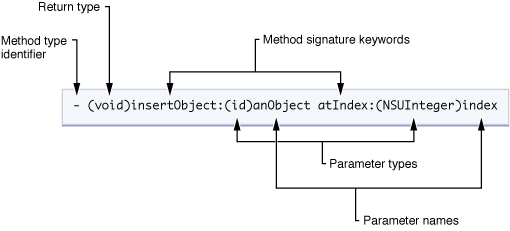

## 调用方法的本质



SEL （selector选择器,它是一个数据类型）

```objective-c
// SEL 对象是用来存储方法的
// 获取SEL对象,这里的sel指向存储sayHi方法的SEL对象的地址
SEL sel = @selector(sayHi) ;


// 1.先获取 sayHello 的 sel对象
// 2.将 SEL 发送给 p1对象
// 3.p1对象根据 isa指针 找到 class对象
// 4.class对象 搜寻是否有和传入 sel对象数据匹配,有则执行，没有则向下搜索父类 直到NSObject
[p1 sayHello] ;
```

调用方法的本质就是向对象发送 SEL消息


## 手动调用SEL方法

```objective-c
SEL sel = @selector(sayHi) ;
[p1 performSelector:sel] ;

// 以上代码等同于 [p1 sayHi] ;


// 带参数的手动调用方法
SEL sel2 = @selector(eatWithFood:) ;
[p1 performSelector:sel2 withObject:@"红烧肉"] ;
```


## 动态检测方法

```objective-c
// --  判断类方法是否存在
if([Person respondsToSelector:@selector(run)] == YES){
     NSLog(@"Person 类中有名叫 run 的类方法") ;
}
else{
     NSLog(@"Person 类中没有名叫 run 的类方法") ;
}
//2020-04-08 14:08:05.619770+0800 Test[33155:641919] Person没有名叫run的类方法

// -- 判断对象方法是否存在
if([p respondsToSelector:@selector(run)]){
     NSLog(@"Person 对象中有名叫 run 的对象方法") ;
}
else{
     NSLog(@"Person 对象中没有名叫 run 的对象方法") ;
} 
//2020-04-08 14:08:05.620320+0800 Test[33155:641919] Person有名叫run的对象方法

// --  判断对象方法是否存在
if([Person instancesRespondToSelector:@selector(run)]){
        NSLog(@"Person 类中有名叫 run 的对象方法") ;
}
else{
        NSLog(@"Person 类中没有名叫 run 的对象方法") ;
}


// 判断一个对象是否为指定类的对象或者是指定类的子类对象
NSLog(@"Student is Person:%hhd",[s isKindOfClass:[Person class]]) ;  // 1

// 判断对象是否为指定类的对象（不包括子类）
NSLog(@"Student is Person:%hhd",[s isMemberOfClass:[Person class]]) ;    // 0
NSLog(@"Student is Student:%hhd",[s isMemberOfClass:[Student class]]) ;  // 1

// 判断一个类是否为另外一个类的子类
NSLog(@"Student 是 Person 的子类:%hhd",[Student isSubclassOfClass:[Person class]]) ;  // 1
```


## 构造方法

```objective-c
Person *p = [Person new] ;
// 1. new 是一个类方法
// 2. 在new 方法内部先调用了 alloc 方法分配内存空间
// Person *p = [Person alloc] ;
// 3. 然后调用 init 方法对属性初始化值
// p = [p init] ; 

// 我们将 init 方法称为 构造方法
```


#### 重写构造方法

```objective-c
-（instancetype)init{
		if(self = [self init]){
				self.name = @"无名"; 
        self.age = 0 ;
		}
		return self ;
}
```

#### 自定义构造方法

```objective-c
// Person.h
// 需要提供一个与自定义构造方法功能相同的类方法，让外部快速创建对象
+(instancetype)personWithName:(NSString *)name andAge:(int)age ;
-(instancetype)initWithName:(NSString *)name andAge:(int)age ;

// Person.m
+(instancetype)personWithName:(NSString *)name andAge:(int)age {
		return  [[self alloc] initWithName:name andAge:age] ;
}


-(instancetype)initWithName:(NSString *)name andAge:(int)age{
 		 if(self = [self init])
		{
				self.name = name; 
        self.age = age ;
		}
		return self ;
}


//
Person *p = [[Person alloc]initWithName:@"Jack" andAge:18] ;
Person *p = [Person personWithName:@"Jack" andAge:18] ;
```


---

时间：2020-4-8


