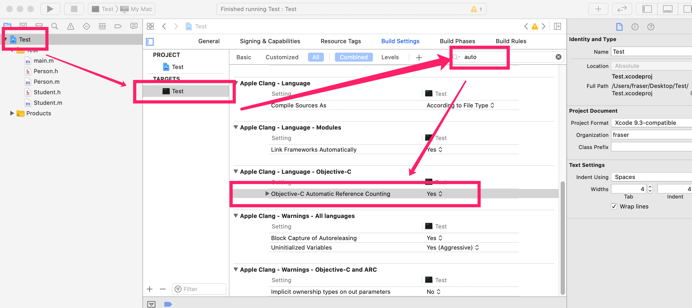

## 概述

| 内存区域 |               存储数据               | 回收点         |
| :------: | :----------------------------------: | -------------- |
|    栈    |             存储局部变量             | 作用域执行完毕 |
|    堆    |          手动申请的字节空间          | 开发者管理     |
|  BSS段   |    未被初始化的全局变量，静态变量    | 初始化后       |
|  数据段  | 常量区，已初始化的全局变量，静态变量 | 程序结束       |
|  代码段  |               存储代码               | 程序结束       |

1. 分配在堆区中的OC对象，需要管理回收
2. 栈，BSS段，数据段，代码段中数据的回收由系统管理，不需要我们干预
3. 内存回收的本质是将字节空间标识为可以分配给别人使用了(旧数据还未被清除)


## 引用计数器 (retainCount)

1. unsigned long占8个字节
2. 用于记录当前对象有多少个地方在使用
3. 当 retainCount 等于 0 时，系统回收这个对象
4. 当系统回收对象时， dealloc 方法会被调用

```objective-c
// 引用计数器 +1
[p retain] ;

// 引用计数器 -1
[p release] ;

// 引用计数器
[p retainCount] ;
```


## 内存管理的分类

- MRC: Manual Reference Counting        手动管理
- ARC:  Automatic Reference Counting   自动管理


## MRC

- 关闭/开启 ARC 【Targets >> Build Setting >>  Objective-C Automatic Reference Counting】

    

- retain的次数要和release的次数要匹配

- 谁用谁retain ， 谁不用谁负责release

```objective-c
// Person.h
@interface Person:NSObject
@end

// Person.m
@implementation Person
-(void)dealloc{
  NSLog(@"人死了") ;
	[super dealloc] ;
}
@end
  
// God.h 
@interface God:NSObject
-(void)killPerson:(Person *)person ;
@end

// God.m
@implementation God
-(void)killPerson:(Person *)person {
		// 这里存在内存泄漏 
		[person retain] ;
		NSLog(@"受死吧!") ;
}

-(void)dealloc{
  NSLog(@"上帝死了") ;
	[super dealloc] ;
}
@end

// main.m
Person *person = [Person new] ;
God *god = [God new]
//
[god killPerson:person] ;
//
[god release]
[person release] ;
```


## 野指针

指针指向的对象已经被回收了，这种指针称为野指针

```objective-c
Person *p = [Person new] ;
[p release] ;

// 处理野指针
// 将指针设置为 nil 
p = nil ;
```


## 僵尸对象

一个已经被释放的对象，但是这个对象占用的字节空间还未分配给别人，这样的对象称为僵尸对象。

僵尸对象的实时检查机制:(影响性能，开发阶段使用)

​			【Edit Scheme >> Run >> Diagnostics >> Enable Zombie Objects】

```objective-c
Person *p = [Person new] ;
[p release] ;

// 这里p对象已经被释放了，所以p是个僵尸对象
[p sayHello] ;
```


## setter方法的内存管理

```objective-c
-(void)setCar:(Car *)car{
    if(_car != car){
    		[_car release] ;
	  		_car = [car retain] ;
	  }
}

-(void)dealloc{
		[_car release] ;
		[super dealloc] ;
}
```


## 循环retain

当两个对象相互引用时，如果都使用retain，会发生内存泄漏。

这个时候一边需要设置为assign 


## @autorelease - 自动释放池

```
@autorelease{
  // 创建对象并将对象存储到自动释放池中 
	Person *p = [[[Person alloc] init] autorelease] ;
}
// 在释放池结束时，会自动对池中的所有对象发出一条 release 消息
```


# ARC (编译机制)

- IOS5 引入
- ARC是编译机制，在编译代码时，编译器在适当的位置加入retain,release和autorelease代码
- 没有强指针指向对象时，这个对象会被**立即**回收


# 强指针&&弱指针 (用于回收的基准)

```
// 强指针
Person *person = [Person new] ;

// 弱指针 
__weak Person *person = [Person new] ;

// 如果一个对象没有任何强指针指向它时，这个对象会被**立即**回收
```


---

时间：2020-4-8

