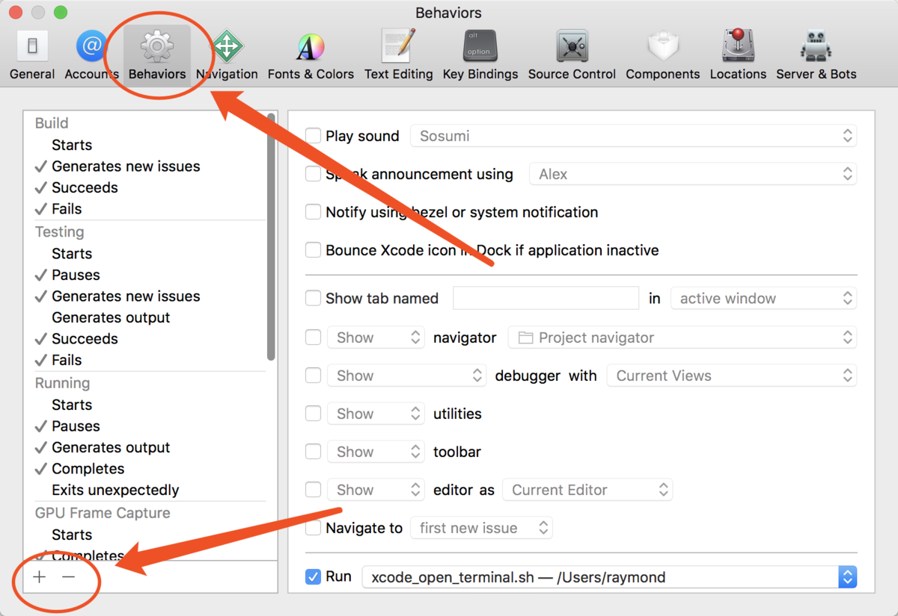
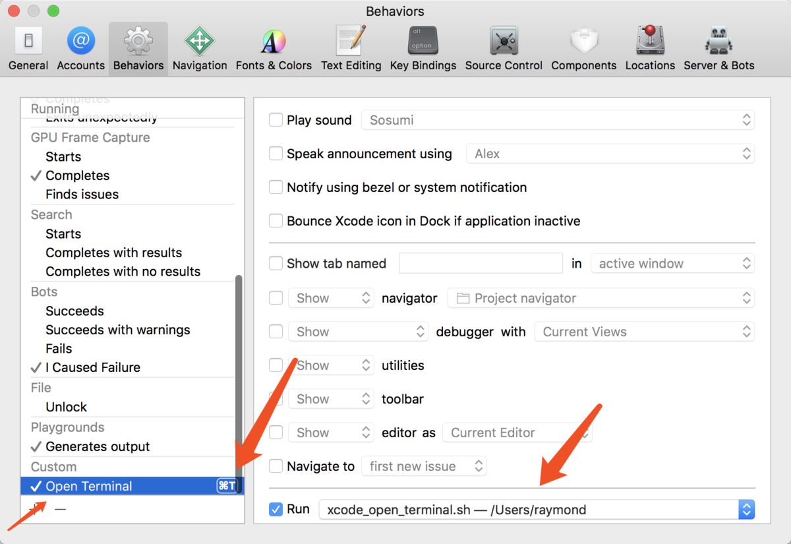

# 建立脚本文件 (terminal.sh)

```shell
#!/bin/sh

if [ -n "$XcodeProjectPath" ]; then
  open -a Terminal "$XcodeProjectPath"/..
else
  open -a Terminal "$XcodeWorkspacePath"/..
fi
```


# 将 terminal.sh 文件设置为可执行文件

```
chmod u+x ./terminal.sh
```


# 将脚本设置到 XCode 中






将 behavior 的名称设置为 `Open Terminal` 或自定义的名字, 然后设置快捷键为 `command + T` 或自己想要的快捷键. 并且在右边的 Run 前面打钩, 然后将新建的脚本设置进去即可.


