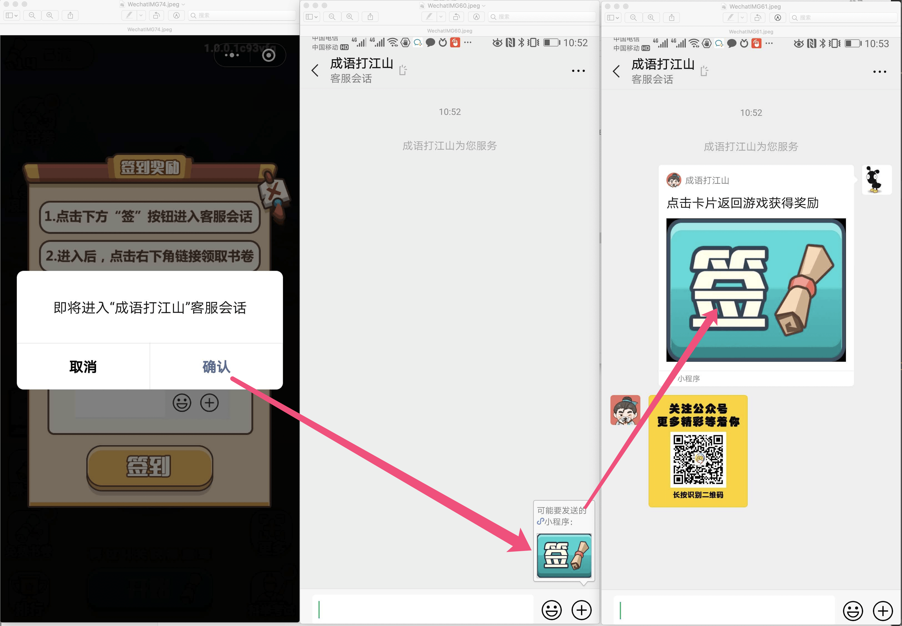

# 客服会话

```typescript
if (wx.openCustomerServiceConversation) {
    wx.openCustomerServiceConversation({
            showMessageCard: true,
            sendMessageTitle: "长按识别二维码，关注公众号领奖励！",
            sendMessagePath: "pages/index?cp_mini_type=1",
            sendMessageImg: "https://cdn.kxtoo.com/car/pharseman/wx_cfg/cs_icon_ma.png",
            success: (r) => {
                // 获取从会话返回的参数
                let param1: number = r['query']['param1'];
                let param2: number = r['query']['param2'];
                // 从客服回话点击卡片回归，调用 success 方法
                // 根据返回的参数来领取奖励
            },
            fail: () => {
            },
            complete: () => {
            }
        });
} else {
    wx.showModal({
      title: '提示',
      content: '当前微信版本过低，无法使用客服会话功能，请升级到最新微信版本后重试。'
    })
}

// 此处功能需要后台同学配合开发在客服会话内的交互功能
```




---

内容如有错误联系方式:15821004383@163.com

更新时间：2020-4-9        