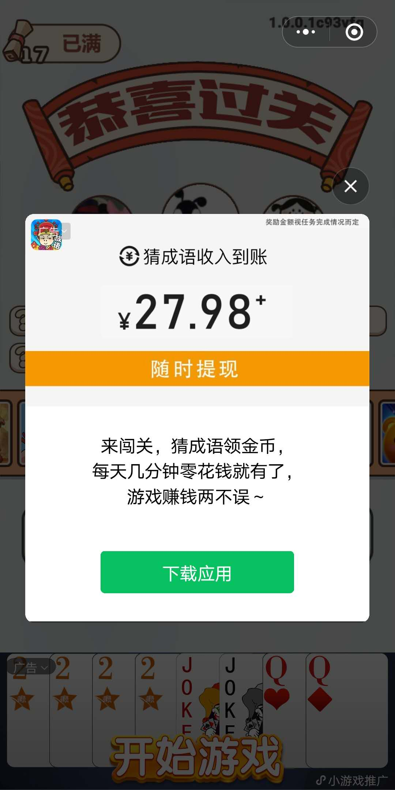

# GamePortal

小游戏推荐弹窗组件。小游戏推荐弹窗组件是一个原生组件，层级比上屏 Canvas 高，会覆盖在上屏 Canvas 上。小游戏推荐弹窗组件默认是隐藏的，需要调用 GamePortal.show() 将其显示。



```typescript
WXGamePortalAd.show("PBgAAdIb599UklY0",
	()=>{
			// 显示成功时逻辑
	},
	()=>{
			// 显示失败时逻辑
	},
	this) ;
```

> 辅助类

```typescript
module WXGamePortalAd {

    var _isPlayGamePort: boolean = false;
    var _gamePortalAd = null;
    var _gamePortalCB = null;
    var _gamePortalCBError = null;
    var _gamePortalCBThis = null;

    export function show(unit: string, cb: Function, cbErr: Function, cbThis: any): void {
        if (unit && WXVerson.compareSDK("2.7.5")) {
            if (!_isPlayGamePort) {
                _isPlayGamePort = true;
                //
                if (_gamePortalAd == null && wx.createGamePortal) {
                    _gamePortalAd = wx.createGamePortal({ adUnitId: unit });
                }
                //
                if (_gamePortalAd) {
                    _gamePortalCB = cb;
                    _gamePortalCBError = cbErr;
                    _gamePortalCBThis = cbThis;
                    //
                    addGamePortalListerns();
                    //
                    try {
                        _gamePortalAd.show();
                    } catch (err) {
                        rmGamePortalListerns();
                        _gamePortalAd = null;
                        _isPlayGamePort = false;
                        _gamePortalCB = null;
                        _gamePortalCBError = null;
                        _gamePortalCBThis = null;
                        //
                        if (_gamePortalCBError != null) {
                            _gamePortalCBError.call(_gamePortalCBThis);
                            _gamePortalCBError = null;
                        }
                    }
                }
                else {
                    _isPlayGamePort = false;
                    cbErr.call(cbThis);
                }
            }
            else {
                cbErr.call(cbThis);
            }
        }
        else {
            cbErr.call(cbThis);
        }
    }

    function onGamePortalClose(status): void {
        if (_gamePortalCB != null) {
            _gamePortalCB.call(_gamePortalCBThis, status == undefined || (status && status.isEnded));
        }
        //
        rmGamePortalListerns();
        _gamePortalAd = null;
        _isPlayGamePort = false;
        _gamePortalCB = null;
        _gamePortalCBError = null;
        _gamePortalCBThis = null;
    }

    function onGamePortalError(errMsg): void {
        if (_gamePortalCBError != null) {
            _gamePortalCBError.call(_gamePortalCBThis);
            _gamePortalCBError = null;
        }
        //
        rmGamePortalListerns();
        _gamePortalAd = null;
        _isPlayGamePort = false;
        _gamePortalCB = null;
        _gamePortalCBError = null;
        _gamePortalCBThis = null;
    }

    function onGamePortalLoad(): void {
        //
    }

    function addGamePortalListerns(): void {
        if (_gamePortalAd) {
            _gamePortalAd.onError(onGamePortalError);
            _gamePortalAd.onClose(onGamePortalClose);
            _gamePortalAd.onLoad(onGamePortalLoad);
        }
    }

    function rmGamePortalListerns(): void {
        if (_gamePortalAd) {
            _gamePortalAd.offError(onGamePortalError);
            _gamePortalAd.offClose(onGamePortalClose);
            _gamePortalAd.offLoad(onGamePortalLoad);
        }
    }
}
window['WXGamePortalAd'] = WXGamePortalAd;


```

