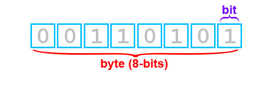
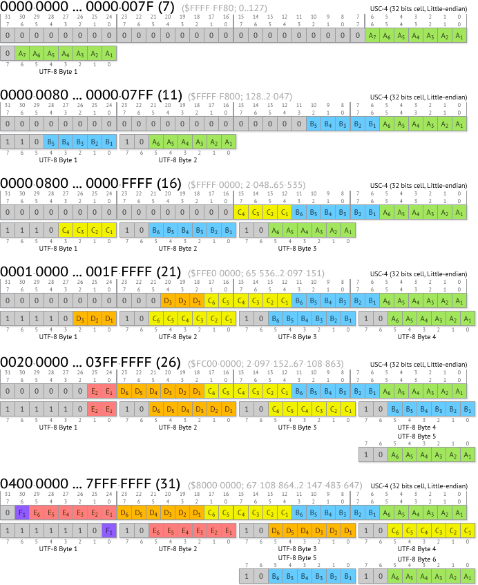

# ASCII，Unicode 和 UTF-8

##  预备知识

`bit`：位，一个位就代表一个 0 或 1，二进制单位。

数据传输大多是以“位”为单位，例如：100Mbps 即 Mbit/s，兆比特每秒。

`byte`：字节，计算机中用于计量存储容量的一种计量单位。

关系：8 `bit`s = 1 `byte`

##  ASCII

> ASCII，/ˈæski/，**A**merican **S**tandard **C**ode for **I**nformation **I**nterchange
> **美国信息交换标准代码**

每一个 bit 有 0 和 1 两种状态，因此八个二进制位就可以组合出 256 种状态，这被称为一个 byte。也就是说，一个字节一共可以用来表示 256 种不同的状态，**每一个状态对应一个符号**，就是 256 个符号，从 0000000 到 11111111。

ASCII 码一共规定了 128 个字符的编码（[ASCII 对照表](https://link.jianshu.com/?t=http://tool.oschina.net/commons?type=4)），这 128 个符号只占用了一个字节的后面 7 位，最前面的 1 位统一规定为 0。

英语字母及一些符号用 128 个符号编码就足够了，但是用来表示其他语言，128 个符号是远远不够。

##  Unicode

Unicode 是为了解决传统的字符编码方案的局限而产生的，它为每种语言中的每个字符设定了**统一并且唯一**的二进制编码，以满足跨语言、跨平台进行文本转换、处理的要求。

#### 2.1 编码

在表示一个 Unicode 字符时，通常会用 `U+`然后紧接着一组十六进制的数字来表示这一个字符。例如：`U+0041`表示英语大写字母 `A`，`U+4E25`表示汉字 “严”。

#### 2.2 实现

Unicode 是一个符号集。Unicode 的实现方式不同于编码方式。一个字符的 Unicode 编码是确定的，但是在实际传输过程中，由于不同系统平台的设计不一定一致，对 Unicode 编码的实现方式有所不同。Unicode的实现方式称为 **Unicode 转换格式**（Unicode Transformation Format，简称为 UTF）。

#### 2.3 问题

Unicode 字符的十六进制数转换成二进制数时，一般用 2 个字节表示 1 个字符，表示其他更偏的字符，可能需要 3 或 4 个字节，甚至更多。

如果一个仅包含 7 bits 的 ASCII 字符（例如一个英文字母）使用 Unicode 编码，如果 Unicode 统一规定每个字符都使用 2 个或更多字节表示，那么这些字节中前几个字节就必然要补 0。虽然乱码问题得到解决，但是这对于存储来说是极大的浪费。
例如：字母 A 的 Unicode 二进制编码是 `00000000 01000001`。

## UTF-8

UTF-8 是 Unicode 的一种实现方式。其他实现方式还包括 UTF-16 和 UTF-32。

UTF-8 是一种变长编码，根据具体字符来变更所需的表示字节。它将基本 7 位 ASCII 字符仍用 7 位编码表示，占用一个字节（首位补 0）。而遇到与其他 Unicode 字符混合的情况，将按一定算法转换，每个字符使用 1-3 个字节编码，并利用首位为 0 或 1 进行识别。这样对以 ASCII 字符为主的英文文档就大幅节省了编码长度。

#### 3.1 规则

UTF-8 的编码规则只有二条：

1. 对于 128 个 ASCII 字符只需一个字节表示，字节的第一位补 0，后面 7 位为这个字符的 ASCII 二进制数。Unicode 范围为 U+0000 至U+007F。
2. 对于 n 字节的符号（n>1），第一个字节的前 n 位都设为 1，第 n+1 位设为 0，后面字节的前两位一律设为 10。剩下的没有提及的二进制位，全部为这个符号的 Unicode 码二进制数。Unicode 范围由 U+0080 起。

下表总结了编码规则，字母 x 表示可用编码的位。

| Unicode 范围 （十六进制） | UTF-8 编码 （二进制）          |
| :----------------------------- | :---------------------------------- |
| U+0000 ~ U+007F                | 0xxxxxxx                            |
| U+0080 ~ U+07FF                | 110xxxxx 10xxxxxx                   |
| U+0800 ~ U+FFFF                | 1110xxxx 10xxxxxx 10xxxxxx          |
| U+10000 ~ U+10FFFF             | 11110xxx 10xxxxxx 10xxxxxx 10xxxxxx |

**注释**：十六进制 007F 转换十进制为 127，二进制为 01111111。

以汉字“严”为例，演示如何实现 UTF-8 编码。
"严"的 Unicode 是 U+4E25（二进制数 100111000100101），据表，U+4E25 处在第三行的范围内（U+0800 ~ U+FFFF），因此“严”的UTF-8 编码需要三个字节，即格式 `1110xxxx 10xxxxxx 10xxxxxx`。然后，从“严”的最后一个二进制位开始，依次从后向前填入格式中的 `x`，多出的位补 0。这样就得到 UTF-8 编码（二进制）是 `11100100 10111000 10100101`，转换成十六进制就是 `E4B8A5`。

下图也总结了上述的编码规则。

https://link.jianshu.com/?t=http://www.liaoxuefeng.com/wiki/0014316089557264a6b348958f449949df42a6d3a2e542c000/001431664106267f12e9bef7ee14cf6a8776a479bdec9b9000)
