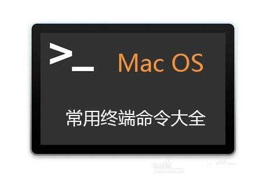
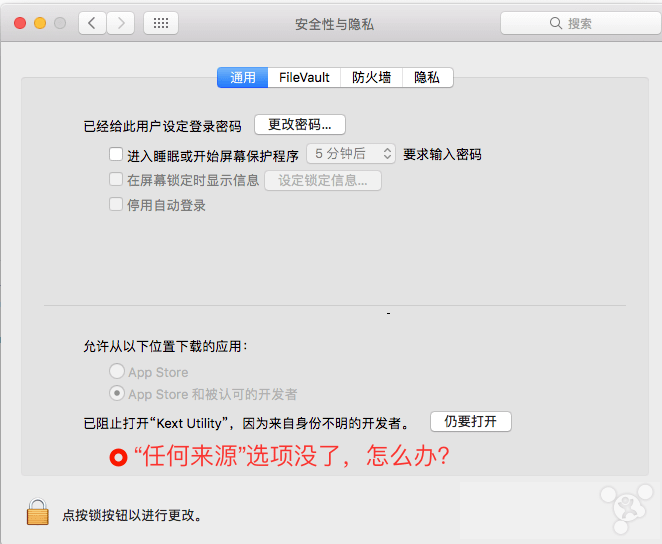

>  **安装允许任何来源**

```
sudo spctl --master-disable
defaults write com.apple.LaunchServices LSQuarantine -bool false
```




>  **显示/隐藏''隐藏文件"**

```
defaults write com.apple.finder AppleShowAllFiles -bool true       此命令显示
defaults write com.apple.finder AppleShowAllFiles -bool false      此命令关闭隐藏
```


>  **visual code 无法更新**

```
sudo chown $USER ~/Library/Caches/com.microsoft.VSCode.ShipIt/ 
```


>  **目录操作**

| 命令   | 功能描述             | 示例             |
| ------ | -------------------- | ---------------- |
| mkdir  | 创建一个目录         | mkdir dirname    |
| rmdir  | 删除一个目录         | rmdir dirname    |
| mvdir  | 移动或重命名一个目录 | mvdir dir1 dir2  |
| cd     | 改变当前目录         | cd dirname       |
| pwd    | 显示当前目录的路径名 | pwd              |
| ls     | 显示当前目录的内容   | ls -la           |
| dircmp | 比较两个目录的内容   | dircmp dir1 dir2 |


>  **文件操作**

| 命令 | 功能描述               | 示例                                 |
| ---- | ---------------------- | ------------------------------------ |
| cat  | 显示或连接文件         | cat filename                         |
| pg   | 分页格式化显示文件内容 | pg filename                          |
| more | 分屏显示文件内容       | more filename                        |
| od   | 显示非文本文件的内容   | od -c filename                       |
| cp   | 复制文件或目录         | cp file1 file2                       |
| rm   | 删除文件或目录         | rm filename                          |
| mv   | 改变文件名或所在目录   | mv file1 file2                       |
| ln   | 联接文件               | ln -s file1 file2                    |
| find | 使用匹配表达式查找文件 | find . -name “*.c” -print            |
| file | 显示文件类型           | file filename                        |
| open | 使用默认的程序打开文件 | open filename（open . 打开当前目录） |

> **选择操作**

| 命令  | 功能描述                       | 示例                         |
| ----- | ------------------------------ | ---------------------------- |
| head  | 显示文件的最初几行             | head -20 filename            |
| tail  | 显示文件的最后几行             | tail -15 filename            |
| cut   | 显示文件每行中的某些域         | cut -f1,7 -d: /etc/passwd    |
| colrm | 从标准输入中删除若干列         | colrm 8 20 file2             |
| paste | 横向连接文件                   | paste file1 file2            |
| diff  | 比较并显示两个文件的差异       | diff file1 file2             |
| sed   | 非交互方式流编辑器             | sed “s/red/green/g” filename |
| grep  | 在文件中按模式查找             | grep “^[a-zA-Z]” filename    |
| awk   | 在文件中查找并处理模式         | awk ‘{print 111}’ filename   |
| sort  | 排序或归并文件                 | sort -d -f -u file1          |
| uniq  | 去掉文件中的重复行             | uniq file1 file2             |
| comm  | 显示两有序文件的公共和非公共行 | comm file1 file2             |
| wc    | 统计文件的字符数、词数和行数   | wc filename                  |
| nl    | 给文件加上行号                 | nl file1 >file2              |

**安全操作**

| 命令   | 功能描述               | 示例                    |
| ------ | ---------------------- | ----------------------- |
| passwd | 修改用户密码           | passwd                  |
| chmod  | 改变文件或目录的权限   | chmod ug+x filename     |
| umask  | 定义创建文件的权限掩码 | umask 027               |
| chown  | 改变文件或目录的属主   | chown newowner filename |
| chgrp  | 改变文件或目录的所属组 | chgrp staff filename    |
| xlock  | 给终端上锁             | xlock -remote           |

 

**编程操作**

| 命令  | 功能描述                 | 示例                       |
| ----- | ------------------------ | -------------------------- |
| make  | 维护可执行程序的最新版本 | make                       |
| touch | 更新文件的访问和修改时间 | touch -m 05202400 filename |
| dbx   | 命令行界面调试工具       | dbx a.out                  |
| xde   | 图形用户界面调试工具     | xde a.out                  |

 

**进程操作**

| 命令   | 功能描述               | 示例             |
| ------ | ---------------------- | ---------------- |
| ps     | 显示进程当前状态       | ps u             |
| kill   | 终止进程               | kill -9 30142    |
| nice   | 改变待执行命令的优先级 | nice cc -c *.c   |
| renice | 改变已运行进程的优先级 | renice +20 32768 |

 

**时间操作**

| 命令 | 功能描述                 | 示例       |
| ---- | ------------------------ | ---------- |
| date | 显示系统的当前日期和时间 | date       |
| cal  | 显示日历                 | cal 8 1996 |
| time | 统计程序的执行时间       | time a.out |

 

**网络与通信操作**

| 命令   | 功能描述                          | 示例                        |
| ------ | --------------------------------- | --------------------------- |
| telnet | 远程登录                          | telnet hpc.sp.net.edu.cn    |
| rlogin | 远程登录                          | rlogin hostname -l username |
| rsh    | 在远程主机执行指定命令            | rsh f01n03 date             |
| ftp    | 在本地主机与远程主机之间传输文件  | ftp ftp.sp.net.edu.cn       |
| rcp    | 在本地主机与远程主机 之间复制文件 | rcp file1 host1:file2       |
| ping   | 给一个网络主机发送 回应请求       | ping hpc.sp.net.edu.cn      |
| mail   | 阅读和发送电子邮件                | mail                        |
| write  | 给另一用户发送报文                | write username pts/1        |
| mesg   | 允许或拒绝接收报文                | mesg n                      |

 

> **Korn Shell 命令**

| 命令    | 功能描述                        | 示例            |
| ------- | ------------------------------- | --------------- |
| history | 列出最近执行过的 几条命令及编号 | history         |
| r       | 重复执行最近执行过的 某条命令   | r -2            |
| alias   | 给某个命令定义别名              | alias del=rm -i |
| unalias | 取消对某个别名的定义            | unalias del     |

 

>  **其它命令**

| 命令   | 功能描述                       | 示例         |
| ------ | ------------------------------ | ------------ |
| uname  | 显示操作系统的有关信息         | uname -a     |
| clear  | 清除屏幕或窗口内容             | clear        |
| env    | 显示当前所有设置过的环境变量   | env          |
| who    | 列出当前登录的所有用户         | who          |
| whoami | 显示当前正进行操作的用户名     | whoami       |
| tty    | 显示终端或伪终端的名称         | tty          |
| stty   | 显示或重置控制键定义           | stty -a      |
| du     | 查询磁盘使用情况               | du -k subdir |
| df     | 显示文件系统的总空间和可用空间 | df /tmp      |
| w      | 显示当前系统活动的总信息       | w            |

###  rename your pdfs

```shell
for i in file*;do mv $i $i.pdf;done
```


### 统计文件行数

```shell
wc -l yourfile
-l 行
-w 字
-c/m 字符
```


### 查看日期

```shell
cal apr 2019
```


### 查看文件列表

```shell
ls /Application 
```

```shell
ls $HOME/Documents | wc -l
```

### 磁盘占用情况
```shell
df -f /
```

### 当前进程列表
```shell
top
```

### 用户

```shell
last $USER
whoami   // 当前登录用户
```


### ip地址

```shell
ipconfig
ipconfig getifaddr en0
ipconfig getifaddr en1

ifconfig
```


### 查看域名信息

```shell
whois www.baidu.com | less
```


### 基础

```shell
pwd
ls
cd
echo
clear
exit
type (打印命令所在目录)
```


###  通配符

```
*  		Zero or more consecutive chars
?  		a single char 
[set]  	any single char in given set .like [aeiouAEIOU]
[^set]
[!set] 	! is equivalent to ^
{X,YY,ZZZ}    echo sand{x,yy,zzz}wich   
// sandxwich  sandyywich sandzzzwich
```


### 变量声明

```
myVar=3   // 不可以有空格
echo $myVar
echo $PATH
export myVar=3 // 全局变量
```


```
printenv
printenv HOME
echo $HOME

alias ll='ls -l'
```


### 重定向符号

```
cmd < infile
cmd > outfile	  // create/overwirte outfile
cmd >> outfile    // append to outfile
```


####Combining commands

```
cmd1 ;cmd2 ;cmd3  // 独立运行
cmd1 && cmd2 && cmd3  // 顺序执行任何一个失败即终止
cmd1 || cmd2 || cmd3  // 顺序执行任何一个成功即终止
```


