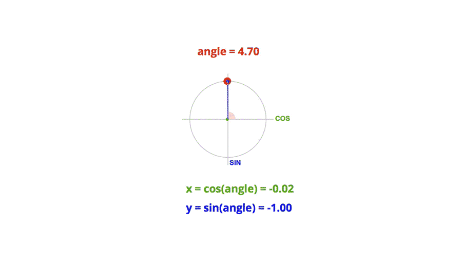

# 三角函数在前端动画中的应用

三角函数已经是老生常谈了（街舞圈称之为 Old School），它伴随我们从初中到大学，太多的公式定理，光是应付考试就花了不少时间。先简单回顾一下，确保你还记得基础知识。

勾股定理

最开始学三角函数的时候就是从背勾三股四弦五开始，勾股定理描述的是对于直角三角形，直角两条边的平方和等于斜边的平方，


## 常用三角函数


```
sinθ = a / h 
cosθ = b / h 
tanθ = a / b
```


## 极坐标系和单位圆

在笛卡尔直角坐标系中，任一点 (x, y) 都可以转化成极坐标表示 (r, θ)

```
r = Math.sqrt(x^2 + y^2) 
θ = Math.atan2(y, x)
```

单位圆的定义是半径为单位长度的圆，圆上任意一点的横坐标就是对应角度的余弦值，任意点的纵坐标就是对应角度的正弦值。




## 简单的图像变换
以正弦曲线为例，对函数进行简单的变换，得到不一样的结果。


正弦曲线公式：y = A * sin(Bx + C) + D

- A 控制振幅，A 值越大，波峰和波谷越大，A 值越小，波峰和波谷越小；
- B 值会影响周期，B 值越大，那么周期越短，B 值越小，周期越长。
- C 值会影响图像左右移动，C 值为正数，图像右移，C 值为负数，图像左移。
- D 值控制上下移动。


## 常见的应用场景

1. 图像应用

最直观的应用是使用三角函数来绘制 Wave 曲线
```
for (let x = 0; x < width; x++) { 
    const y = Math.sin(x * a) * amplitude ;
}


for (let x = 0; x < width; x++) { 
    const radians = x / width * Math.PI * 2 
    const scale = (Math.sin(radians - Math.PI * 0.5) + 1) * 0.5 
    const y = Math.sin(x * 0.02 + xSpeed) * amplitude * scale 
}
```
https://codepen.io/HelKyle/


2. SlowInSlowOut
正余弦曲线有很自然地缓入缓出的特性，并且在一个周期里面从 -1 到 1 再回到 -1，非常适合用来模拟一些物理效果。因为真实世界里面，汽车都是缓慢启动，加速，减速，再缓慢减速直到速度变为 0 的，突变会让人很难受。左边的摆球是线性匀速摆动，右边是用了三角函数优化的结果。显然左边的效果设计师会打人。
```
ctx.rotate(Math.cos(t / 180 * Math.PI) * Math.PI * 0.25)
```


3. 角度控制

在开发过程中，我们常常需要跟角度打交道，比如在头像左上角（45deg）显示 Notification 红点，用鼠标控制 rotation 等等
前端 JS 里面 Math.atan2(y, x) 可以用来计算 (x, y) 和 x 轴正方向的夹角弧度值。
```
function getCurrentDegree () { 
    const deltaX = mouse.x - window.innerWidth * 0.5 
    const deltaY = mouse.y - window.innerHeight * 0.5 
    return Math.atan2(deltaY, deltaX) * 180 / Math.PI 
}
```


